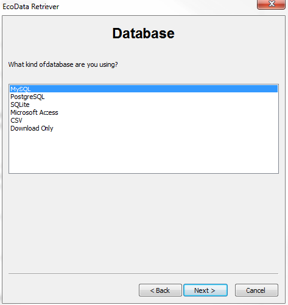
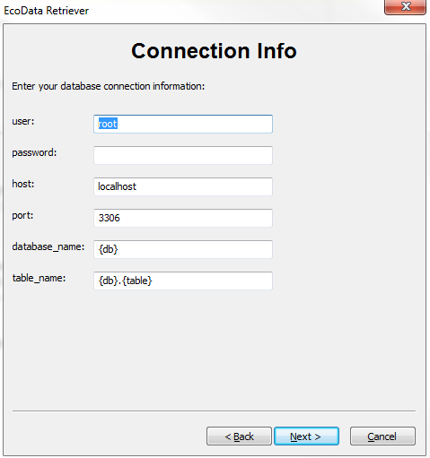
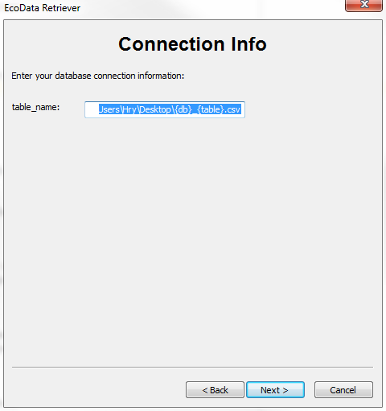
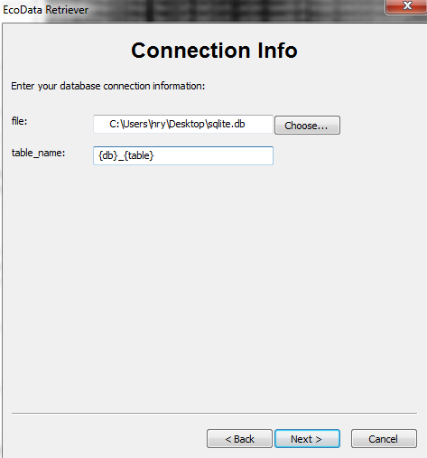
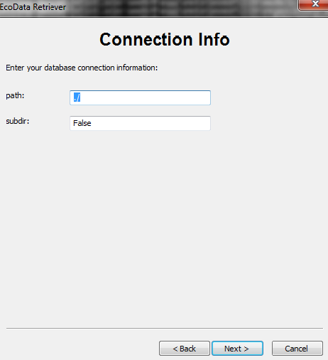
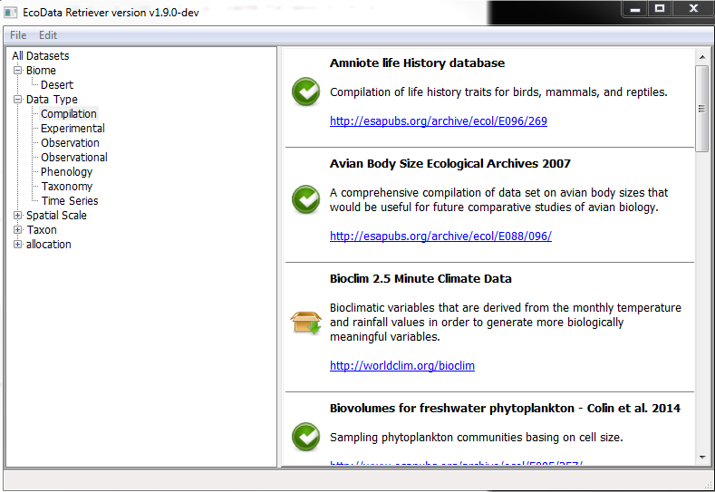

=============
Using the Gui
=============

To start the gui using command line

::

   retriever     (giving no options)
   
   or:

   retriever gui   (specifying the gui options)  

When the retriever starts for the first time or after a full reset, a page pops up with information about the available database systems(engines) as shown in the figure below:

The figure gives the list of the engines that are available. 

::

   -mysql
   -postgres
   -sqlite
   -msaccess
   -csv
   -download_only

Choose an engine that you would like to use.

Each engine has its own required options that it would use to make a connection to you data store.
EcoData Retriever has build in defualt options that you can easily use.

NOTE: However, If your data store has specific settings please adjust them accordingly as below.

In case you are using Postgres or MySQL engines

**MySQL and Postgres:**

::

      user: Enter your MySQL username,   default is  root
      password: Enter your password, default is ""
      host: Enter your MySQL or Postgres host, localhost 
      port: Enter your MySQL or Postgres port, 3306
      database_name:  database name ,default is {db} based on the data you are downloading
      table_name: Format of table name, default is {db}.{table} based on the data you are downloading

    
    
**Using csv**

::

   {db}_{table} : Defualts are automatically obtained from the the data we downloading
   {db} :  used to give a name to database 
   {table} : used to give a name to the table
    

**Using sqlite**

::

   file: Enter the filename of your SQLite database
   {db}_{table}:  Format of table name a combination of  
                  {db} Database name and {table} table name 
       

**Using download_only**

The figure below shows the download page. 

Menu::

   The File menu bar has:
   About: used to get infomation about the EcoData retriever like version being run 
   Connection:  Use this menu bar to change to other database systems
   Exit: To exit the program
    

    
    
To download data, click on the download icon which is shwon below:

The icon below indicates that the download is ready and you can exit the program:

